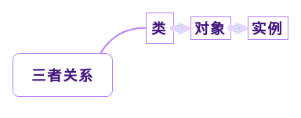
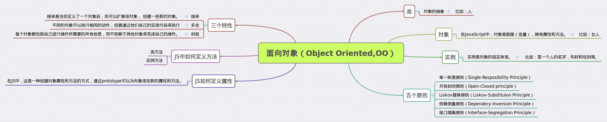

# Javascript - OO的介绍
##（1）什么是类，对象，实例？
###1.1:类（class）：
是对象（object）的模板，
定义了同一组对象（又称"实例"）共有的属性和方法也可以简单称之为类型，类别。


比如：人。
###1.2：对象（object）：
在JavaScript中，对象是数据（变量），拥有属性和方法。


比如：某一个人。
###1.3：实例（Instance）：
实例是对象的现实体现。


比如：某一个人的名字，年龄和性别等。
###1.4：类，对象，实例的关系：

##（2）JS中如何定义Class？
```javascript

      function Person(name,age,sex) {
      this.name = name；
      this.age = age;
      this.sex = sex；
    }
```  
##（3）JS中如何定义属性，方法？
###3.1：属性的定义：
```javascript
     var gaofanfan = new Person('高翻翻',22;'female')；
```
###3.2：JS方法的定义：分为类方法和实例方法，我们先来看看类方法
###类方法：
```javascript

    function Person(name,age,sex) {
      this.name = name；
      this.age = age;
      this.sex = sex；
    }
    var moumou = new Person('xxx',20;'male');
    console.log(moumou.name);
    console.log(moumou.age);
    console.log(moumou.sex);
```
###实例方法：
```javascript
    function Person(name,age,sex) {
      this.name = name；
      this.age = age;
      this.sex = sex；
      }

    Person.output = function() {
      return "世界创造了何等奇迹！！！"；
    }

    Person.prototype.getName = function() {
      return this.name;
    }

    var person = new Person('fanfan',22,'female');
    var name = person.getName();
    console.log(name);

    var output = Person.output();
    console.log(output);
```
##（4）面向对象的三特性（封装,继承,多态）
###继承（Inherit of Person）：
继承是当你定义了一个对象后，你可以扩展该对象，
创建一些新的对象。譬如你定义了一个基类Human，
其中的属性有Stature、Weight、Age、Gender等。
假如你此时又要定义另一个类Student并且发现这个
类除了具有以上Human基类的所有属性之外还具有一些
自己特有的属性例如School、Grade、Class、StudentID
等等，这时你就不必重写它的全部属性，只需声明Student
类继承于Human类就可以了，继承提高了我们编写代码的效率。
###例如：
```javascript
    function Person(name,age,sex) {
      this.name = name；
      this.age = age;
      this.sex = sex；
      }
    function Female(name,age) {
      Person.call(this,name,age,'Female');
    }
    Female.prototype = Object.create(Person.prototype);
    Female.prototype.constructor = Female;
    var zhangsan = new Person('zhangsan',22,'Female');
    console.log(zhangsan.name);
```
###多态（Polymorphism）
不同的对象可以执行相同的动作，但要通过他们自己的实现
代码来执行
###例如：
```javascript
     var zhangsan = new Male('zhangsan',15,'Male');
     var lisi = new Female('lisi',18,'Female');
     var person = [zhangsan,lisi];
     for(var i = 0;i < person.length;i++) {
       console.log(person[i].name);
       console.log(person[i].age);
       console.log(person[i].sex);
```
     }
###封装
每个对象都包括自己进行操作所需要的所有信息，
而不依赖于其他对象来完成自己的操作。不能直接操作它的细节。
###例如：
```javascript
    var zhangsan = new Male('zhangsan',15,'Male');
    var lisi = new Female('lisi',18,'Female');
    var person = [zhangsan,lisi];
    function Car(person) {
      this.driverName = person.name;
    }
    Car.prototype.getdriverName = function(person)  {
      return driverName;
    }
    var car = new Car(zhangsan);
    console.log(car.getdriverName());
```

